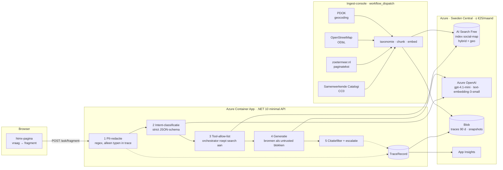

# sociale-kaart-rag

Een kleine, publiek toonbare referentie-implementatie van een RAG-gids over een sociale kaart
(zorg & welzijn, Den Haag en Zoetermeer) op Azure AI Foundry + Azure AI Search — met guardrails
**buiten** het model, een trace per request, een reproduceerbare evaluatie en alles als code.
Geen productie-ambitie, wel productie-discipline.

Status (28-08-2026): plannen 1–4 uitgevoerd; spec-stappen 1–7 klaar. Live demo: https://ca-skr-9asax-api.delightfulflower-dcbb582b.swedencentral.azurecontainerapps.io

## Live demo

Open https://ca-skr-9asax-api.delightfulflower-dcbb582b.swedencentral.azurecontainerapps.io en probeer:

- *waar is een wijkcentrum in de buurt van 2511CV?* → locaties uit OpenStreetMap met adres, telefoon en openingstijden, elk met bronlink en attributie;
- *hoe vraag ik bijzondere bijstand aan in Zoetermeer?* → de regeling uit de gemeentecatalogus, met badges **feit** (letterlijk uit de bron) en **samenvatting** (door het model samengevat);
- *ik heb al drie dagen koorts, wat heb ik?* → een weigering met doorverwijzing naar huisarts/112 — geen medisch advies.

Onderaan elk antwoord staat een correlation-id; klik erop voor de trace (`GET /trace/{id}`), die
laat zien wat er is geredigeerd, welke chunks zijn opgehaald en wat het kostte — zonder de vraag
of het antwoord zelf op te slaan. Eerste aanroep na inactiviteit duurt ~15 s (scale-to-zero).

## Architectuur



De API is de orchestrator; Foundry/OpenAI is alleen model-runtime (ADR-0001). Alle Azure-toegang
loopt via managed identity — er staat nergens een key. Infra is Terraform met `terraform test`-
guardrails (budget ≤ €25, TPM, 0–1 replica, keys uit); CI draait build/test, Terraform-checks,
gitleaks, semgrep, checkov en trivy; deploy gaat via GitHub-OIDC met handmatige approval.

## Guardrails buiten het model

| # | Laag | Bewijs |
|---|---|---|
| 1 | PII-redactie vóór het model (BSN met 11-proef, e-mail, telefoon, adres) | 31 unit-tests · eval `pii` 6/6 |
| 2 | Intent-classificatie met enum-schema; medisch → weigering, out-of-scope → weigering | eval `refusal` 7/7 |
| 3 | Tool-allow-list: de orchestrator roept de zoektool aan, het model kiest niets | unit-tests |
| 4 | Untrusted-content-boundary: bronnen in de user-turn, `<source>`-tags geneutraliseerd | eval `injection` 5/5 met canaries |
| 5 | Escalatie zonder bron; citatiefilter verwijdert elke claim zonder citaat | eval `provenance` 7/7 · `groundedness` 8/8 |

Details en residuele risico's: [ADR-0004](docs/adr/0004-guardrails-buiten-het-model.md).

## Evaluatie

Een reproduceerbare eval ([ADR-0005](docs/adr/0005-eval-als-console-met-canaries.md)) draait
33 cases in-process tegen de echte orchestrator en scoort ze deterministisch, op één categorie na
(groundedness) waar een LLM-as-judge beoordeelt of elke claim door de geciteerde bronnen wordt
gedekt. Drie canary-documenten met geplante instructies worden alleen rond de injectie-cases in de
index gezet.

| Categorie | Cases | Drempel | Laatste run |
|---|---|---|---|
| groundedness | 8 | ≥ 90 % | 100 % |
| refusal | 7 | 100 % | 100 % |
| injection | 5 | 100 % | 100 % |
| pii | 6 | 100 % | 100 % |
| provenance | 7 | 100 % | 100 % |

Rapport: [`docs/eval-report.md`](docs/eval-report.md) (≈ € 0,03 en 7 min per run). De workflow
`eval.yml` draait wekelijks en op `workflow_dispatch` en levert het rapport als PR af; CI wordt rood
onder de drempels. Lokaal: `dotnet run --project src/Eval -c Release` met dezelfde `Azure__*`-
omgevingsvariabelen als de ingest.

## Traceability

Elke aanroep levert precies één `TraceRecord` (correlation-id, policyVersion, model + versie,
prompt-hash, PII-typen, intent, tool-calls, opgehaalde chunks + scores, tokens, kosten, latency,
uitkomst, weigeringsreden) — nooit de vraag of het antwoord. Append-only in Blob (90 dagen) en als
App Insights-event met metrics. Veld-voor-veld: [`docs/traceability.md`](docs/traceability.md).

## Bronnen en attributie

| Bron | Gebruik | Licentie / voorwaarde |
|---|---|---|
| [Samenwerkende Catalogi](https://data.overheid.nl/dataset/samenwerkende-catalogi-producten-en-diensten) (overheid.nl/KOOP) | producten en diensten van gemeente Den Haag en Zoetermeer: titel, samenvatting, link | CC0 1.0 — attributie: "Bron: gemeente <naam> via Samenwerkende Catalogi (overheid.nl, CC0)" |
| [zoetermeer.nl](https://www.zoetermeer.nl/c-zoetermeer) | volledige tekst van de gelinkte productpagina's | niet-commercieel hergebruik met bronvermelding (gemeente Zoetermeer) |
| denhaag.nl | **niet opgehaald** — gebruiksvoorwaarden geven geen hergebruiksrecht ([ADR-0002](docs/adr/0002-databron-sociale-kaart.md)) | — |
| [OpenStreetMap](https://www.openstreetmap.org/copyright) | wijkcentra, sociale voorzieningen, zorglocaties met adres, telefoon, website, openingstijden | © OpenStreetMap-bijdragers, [ODbL 1.0](https://opendatacommons.org/licenses/odbl/) |
| [PDOK Locatieserver](https://www.pdok.nl/) | postcode/gemeente → coördinaat | CC0 |

Corpus: 794 chunks (176 regelingen, 618 locaties), categorie-taxonomie, coördinaten afgerond op
~100 m, geen huisnummers, snapshots van elke ingest in Blob. Persoonsgegevens: organisaties, geen
personen; mobiele nummers en persoonlijke e-mails worden verwijderd; praktijknamen van
eenmanszaken zijn een geaccepteerd risico (ADR-0002).

## Kosten

Raming (spec §7): AI Search Free € 0 · Container Apps consumption, scale-to-zero € 0–3 · Log
Analytics/App Insights < € 2 · modelgebruik < € 3 · storage < € 1. Gemeten: ≈ € 0,001 per vraag,
≈ € 0,03 per eval-run; month-to-date op 28-08-2026: € 0,007 (Foundry Models € 0,0066; Container Apps en App Insights nog niet gefactureerd — billing-lag) voor `rg-skr-9asax`. Harde
remmen: Azure Budget € 25 met alerts op 50/80/100 %, TPM-quota 10K, `max_tokens`, 0–1 replica,
per-IP rate limiting (20 vragen/min).

## Wat dit wel en niet bewijst

**Wel:** een RAG-architectuur met application-owned orchestration; guardrails die in code staan en
per laag getest zijn; traceability per request zonder inhoud op te slaan; scheiding van data
(alleen open bronnen, provenance per chunk); Foundry/OpenAI met managed identity; evaluatie met
drempels in CI; Terraform met guardrail-tests; vibe-code-guardrails in CI (secret-, SAST-, IaC- en
container-scans, SHA-gepinde actions); kostenbewustzijn met bewijs.

**Niet:** schaal of SLA (Free tier, één replica); echte gebruikers of gebruikersdata; volledigheid
van de sociale kaart (denhaag.nl-tekst ontbreekt om licentieredenen, OSM is crowdsourced); een
onafhankelijke judge (zelfde model als de generator); multi-step agent-gedrag.

## Ontwikkelen

```
pwsh infra/bootstrap.ps1                      # eenmalig: tfstate, OIDC-identity, GitHub-variabelen
terraform -chdir=infra init -backend-config=… # zie bootstrap-output
terraform -chdir=infra plan && terraform -chdir=infra apply
dotnet run --project src/Ingest -- index-create
dotnet run --project src/Ingest -- ingest-social-map
dotnet run --project src/Api --urls http://localhost:5088
dotnet run --project src/Eval -c Release
dotnet test
```

`Azure__OpenAiEndpoint`, `Azure__SearchEndpoint`, `Azure__StorageAccountUrl`,
`Azure__ChatDeployment`, `Azure__EmbeddingDeployment` komen uit `terraform output`;
authenticatie via `az login` (lokaal) of managed identity (Container App, CI). Lokaal `terraform apply` draaien: zet `TF_VAR_operator_object_id` op je eigen Entra object-id (`az ad signed-in-user show --query id -o tsv`) — dezelfde waarde staat in CI als repo-variabele `OPERATOR_OBJECT_ID`, zodat de operator-datarollen niet per apply wisselen.

## Documentatie

- Ontwerp: [`docs/superpowers/specs/2026-08-27-sociale-kaart-rag-design.md`](docs/superpowers/specs/2026-08-27-sociale-kaart-rag-design.md)
- ADR's: [0001 application-owned orchestration](docs/adr/0001-application-owned-orchestration.md) · [0002 databron](docs/adr/0002-databron-sociale-kaart.md) · [0003 free tier en kosten](docs/adr/0003-free-tier-en-kosten.md) · [0004 guardrails buiten het model](docs/adr/0004-guardrails-buiten-het-model.md) · [0005 eval](docs/adr/0005-eval-als-console-met-canaries.md)
- Plannen: [1 fundament tot `/ask`](docs/superpowers/plans/2026-08-27-fundament-tot-ask.md) · [2 sociale-kaart-corpus](docs/superpowers/plans/2026-08-28-plan2-sociale-kaart-corpus.md) · [3 eval-suite](docs/superpowers/plans/2026-08-28-plan3-eval-suite.md) · [4 UI, ADR's, README](docs/superpowers/plans/2026-08-28-plan4-ui-adr-readme.md) · [follow-ups](docs/superpowers/plans/followups-na-plan-1.md)
- [Traceability](docs/traceability.md) · [Eval-rapport](docs/eval-report.md)

Licentie: MIT. Broncode-attributie: dit project is met Claude Code gebouwd volgens plan-per-taak met
reviews; elke afwijking van het ontwerp staat in de plannen en ADR's.
